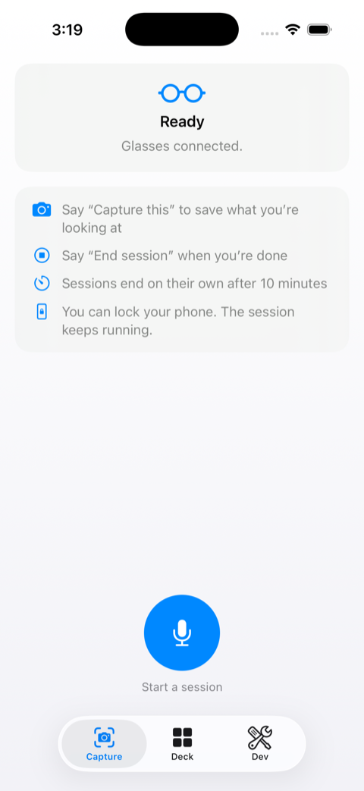
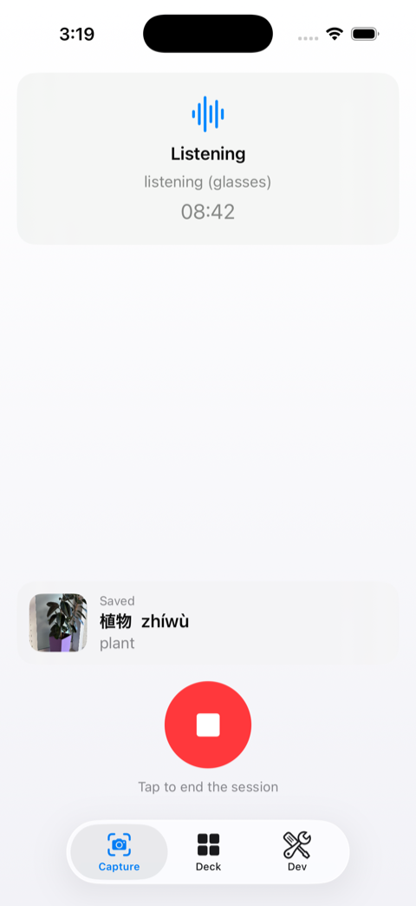
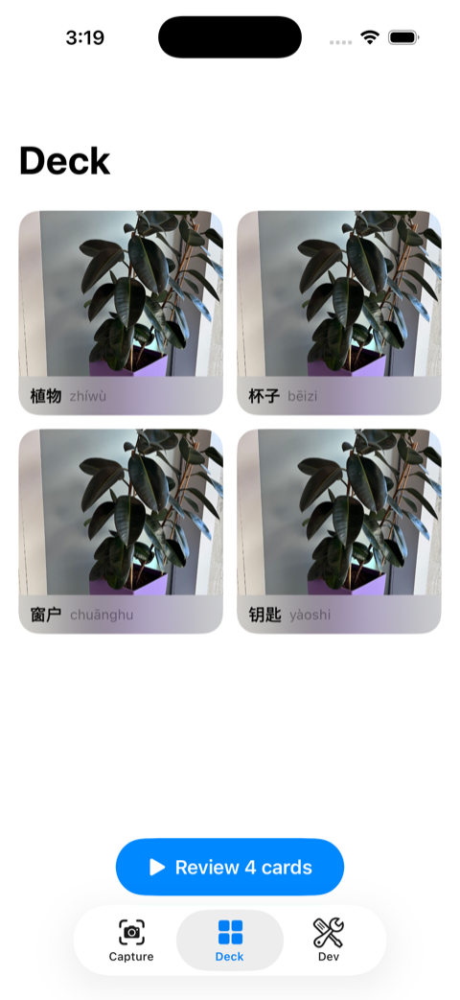
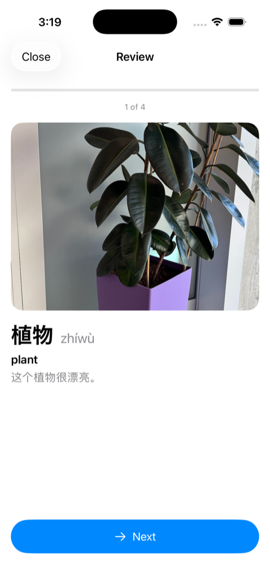

# VocabGlass

A demo application built on **iOS + Meta Ray-Ban (Gen 2)
smart glasses**. It explores pairing an iPhone app with the Meta Wearables
Device Access Toolkit (DAT) and a multimodal AI backend.

This is a demo, not a commercial product: Meta DAT is in developer
preview, so you build the app yourself in Xcode to try it (see Running it).

## What it does

1. You start a voice session from the app while wearing the glasses.
2. You look at a real-world object and ask the assistant to capture it
   ("capture this"). The realtime model calls a tool, the app pulls a still
   photo off the glasses' camera, and confirms by voice.
3. The photo goes to an AI layer that names the object and writes a Chinese
   (Simplified) vocabulary card: word (hanzi), pinyin, English translation, and
   an example sentence.
4. The card is saved with the photo into a local deck you can browse,
   edit, and delete, and review as flashcards: photo first, then reveal
   the word, pronunciation, meaning, and example.

You can capture as many objects as you like in a single session (10 minutes). 
The session keeps running while the phone is locked or in the background, 
and ends by voice ("I'm done"), by button, or after a 10 minute timer. 
Manual capture survives as a debug-only Dev tab for development.

The glasses are an input device, not an app runtime. The app runs on iPhone:
photos come over Bluetooth via the DAT SDK, and voice runs over the OS
Bluetooth audio route (DAT has no microphone API).

## Screenshots

| Home | Voice session | Deck | Flashcards |
|---|---|---|---|
|  |  |  |  |

Home shows the glasses status and voice commands before a session. During
a session the newest capture lands on screen as it is saved. The deck
collects every card with its photo, and flashcard review shows the photo
first, then reveals the word, pronunciation, meaning, and example.

## Architecture

```
Meta Ray-Ban glasses
  camera (DAT SDK, Bluetooth)      mic + speakers (Bluetooth HFP)
        |                                |
        v                                v
iOS app (Swift / SwiftUI)
   - SessionController : runs a voice session as one unit, acts on tool calls
   - RealtimeClient    : WebRTC connection to the OpenAI Realtime API
   - AudioRouteManager : routes session audio through the glasses
   - GlassesClient     : DAT session, camera stream, photo capture
   - CardStore         : local deck (JSON + JPEG files on device)
   - CardAPI           : sends captured photos to the worker
        |  HTTPS                         |  WebRTC (ephemeral key)
        v                                v
Cloudflare Worker (Hono)            OpenAI Realtime API
   - POST /token    : mints an        voice in/out + tool calls
     ephemeral Realtime key           (capture_object, end_session)
   - POST /generate : image in,
     calls Claude, returns a card
        |  Anthropic Messages API (multimodal, structured outputs)
        v
Claude -> { word, pinyin, translation, example } -> saved card
```

The system prompt and tools are baked into the ephemeral key by the worker,
so neither API key ever reaches the phone: the app only ever holds a
short-lived key that can start a VocabGlass session and nothing else.

## Tech stack

- **iOS app**: Swift, SwiftUI, iOS 26+ (MVVM: Models / ViewModels / Views)
- **Glasses**: Meta Wearables DAT SDK 0.8.0 (MWDATCore, MWDATCamera,
  MWDATMockDevice)
- **Voice**: OpenAI Realtime API (`gpt-realtime-2.1`) over WebRTC
- **Backend**: Cloudflare Workers with Hono
- **Cards**: Anthropic Claude (`claude-sonnet-4-6`) with structured outputs

## Running it

- **Worker**: in `worker/`, set `ANTHROPIC_API_KEY` and `OPENAI_API_KEY`
  (in `.dev.vars` for local, or `wrangler secret put` for deploy), then
  `npm run dev` or `npm run deploy`.
- **App**: open `ios/VocabGlass` in Xcode. The simulator runs against a mock
  device with a sample image, so no glasses are needed for development. For
  real glasses (and voice sessions), build to a device with the Meta AI app
  paired and Developer Mode on.
- The app reads the worker URL from a local, gitignored `WorkerConfig.plist`
  (see `WorkerConfig.example.plist`); without it, it falls back to
  `http://localhost:8787`.
