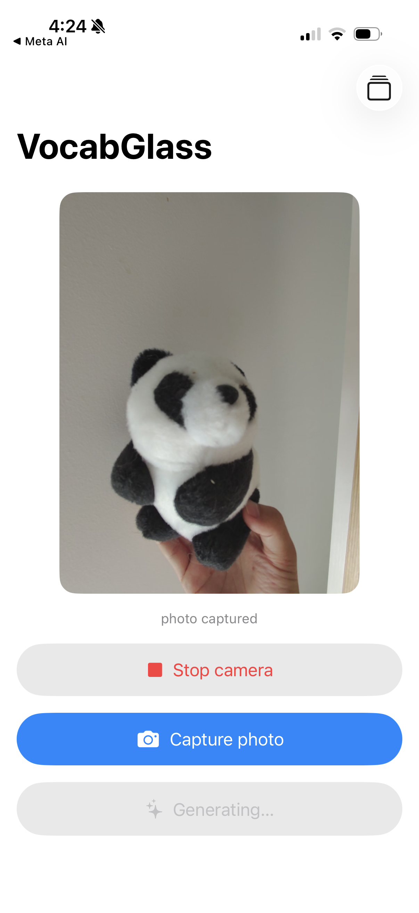
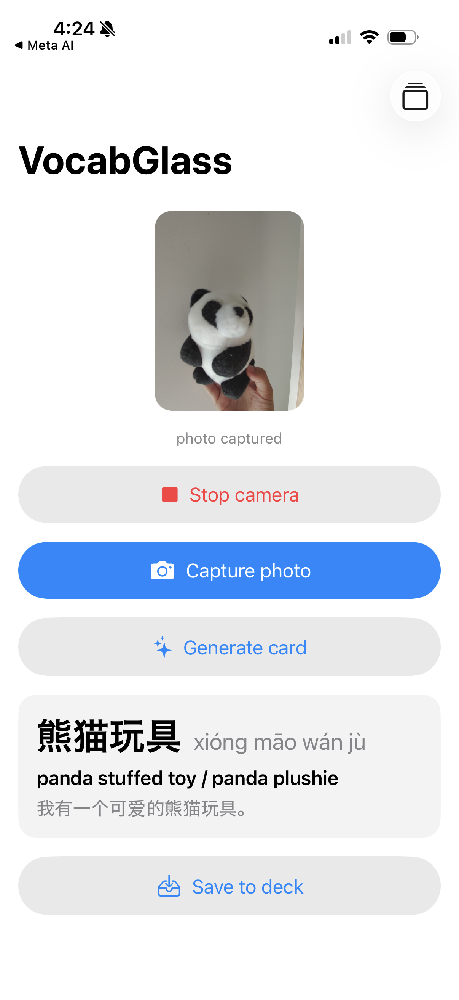

# VocabGlass

A demo application built on **iOS + Meta Ray-Ban (Gen 2)
smart glasses**. It explores pairing an iPhone app with the Meta Wearables
Device Access Toolkit (DAT) and a multimodal AI backend.

This is a demo, not a product. It proves one vertical slice end to end.

## What it does

1. You look at a real-world object through the glasses.
2. You tap Capture in the app, which pulls a still photo off the glasses' camera.
3. The photo is sent to an AI layer that names the object and writes a Chinese
   (Simplified) vocabulary card: word (hanzi), pinyin, English translation, and
   an example sentence.
4. The card is saved with the photo into a local deck you can browse.

The glasses are an input device, not an app runtime. The app runs on iPhone and
reads photos from the glasses over Bluetooth via the DAT SDK.

## Screenshots

| Capture a photo | Generate a card | Browse your deck |
|---|---|---|
|  |  |  |

## Architecture

```
Meta Ray-Ban glasses  (camera, input device)
        |  Bluetooth
        v
Meta AI companion app  (registration + camera permission)
        |  DAT SDK
        v
iOS app (Swift / SwiftUI)
   - GlassesClient   : DAT session, camera stream, photo capture
   - CardStore       : local deck (JSON + JPEG files on device)
   - CardAPI         : sends the photo to the worker
        |  HTTPS, base64 image
        v
Cloudflare Worker (Hono)
   - POST /generate  : image in, calls Claude, returns a card
        |  Anthropic Messages API (multimodal, structured outputs)
        v
Claude -> { word, pinyin, translation, example } -> saved card
```

## Tech stack

- **iOS app**: Swift, SwiftUI, iOS 26+ (MVVM: Models / ViewModels / Views)
- **Glasses**: Meta Wearables DAT SDK 0.7.0 (MWDATCore, MWDATCamera,
  MWDATMockDevice)
- **Backend**: Cloudflare Workers with Hono
- **AI**: Anthropic Claude (`claude-sonnet-4-6`) with structured outputs

## Running it

- **Worker**: in `worker/`, set `ANTHROPIC_API_KEY` (in `.dev.vars` for local,
  or `wrangler secret put` for deploy), then `npm run dev` or `npm run deploy`.
- **App**: open `ios/VocabGlass` in Xcode. The simulator runs against a mock
  device with a sample image, so no glasses are needed for development. For real
  glasses, build to a device with the Meta AI app paired and Developer Mode on.
- The app reads the worker URL from a local, gitignored `WorkerConfig.plist`
  (see `WorkerConfig.example.plist`); without it, it falls back to
  `http://localhost:8787`.
